> **Sanitized copy.** All names, cashiers, incidents, emails and data in this repository are **fictitious samples** for demonstration only. No real credentials, video footage, personal data, or production configuration are included.

# Lone Star — AI Video Intelligence & Operational Platform

<p>
  <a href="https://github.com/furqunali/lonestar-video-intelligence/actions/workflows/tests.yml"></a>
  
  
  
</p>
<p>
  
  
  
  
  
  
  
  
</p>

*An offline, CPU-only computer-vision platform that turns exported store CCTV into
structured events, risk-ranked incidents and a reviewed director report — engineered
for auditability and safety, with 161 tests green in CI.*

Offline AI platform that turns exported store CCTV clips into structured events,
deterministic operational grades, and a simple daily report with human review.

> **Built and maintained by:** Furqan Ali — Senior AI Engineer, SLP Operations.
>
> 📋 **License: review-only.** You may **view and review** this code; you may **not use,
> copy, modify, deploy or redistribute it without the author's written permission.**
> See [`LICENSE`](LICENSE). ✅ **161 automated tests** run in CI on every push.

## 🖥️ Dashboard & incident front-end

The platform produces a **consolidated director report** (a single tabbed HTML
dashboard) and an embedded **chat assistant** — this is the reviewer-facing UI.

- **Sample dashboard (synthetic data):** [`docs/sample_dashboard.html`](docs/sample_dashboard.html)
  — risk-ranked incident table, KPI tiles, illustrative evidence cards, and the
  chat widget. Open it in any browser (no server needed).
- **Chat widget:** [`avip/chat/widget.html`](avip/chat/widget.html) — the
  in-report assistant ("Stella") that answers questions from the events knowledge base.
- The **real** report is generated by `build_consolidated.py` from store-local
  data on the operator's machine and is **never published** — every incident,
  name and frame shown here is a fictitious demonstration; no real footage or
  personal data is in this repository.

## What it does
1. Reads FreeCam **MP4 exports** from the store DVRs (i3 SRX-Pro).
2. Runs camera-health checks + person detection/tracking, and writes **JSON events**.
3. Computes **deterministic grades** (register attended, zone presence, etc.).
4. An AI agent **drafts a plain-language report**; a person reviews it with one tap.

## Architecture

```mermaid
flowchart LR
  A[FreeCam MP4 exports<br/>i3 SRX-Pro DVRs] --> B[Ingest<br/>decode + sample]
  B --> C[Camera health<br/>blur · tamper · clock-drift]
  C --> D[Detect + Track<br/>YOLOv8n · ByteTrack]
  D --> E[Zones<br/>register · floor · entrance]
  E --> F[Identity<br/>ArUco · non-biometric · gated]
  F --> G[(Event store<br/>SQLite / Postgres+Timescale)]
  G --> H[POS-exception<br/>risk scoring]
  H --> I[Incident report<br/>consolidated HTML dashboard]
  I --> J{Human review}
  I --> K[💬 Chat assistant &#40;Stella&#41;]
  T[(Shared deterministic tools<br/>zones · rubric · integrity)] -.-> C & D & E & H
```



Full component-by-component design is in **[`docs/ARCHITECTURE.md`](docs/ARCHITECTURE.md)**.

## ✅ Proof it works

This is a working, verified system — not a slide deck:

- **161 automated tests, green in CI on every push** — see the Tests badge above and the [Actions tab](https://github.com/furqunali/lonestar-video-intelligence/actions). The suite is **offline and deterministic** (synthetic media), so anyone can reproduce it with `pytest`.
- **End-to-end pipeline** covered by tests: ingest → health → detect/track/zones → markers → events → identity → grading → reporting → chat.
- **Sample director report** you can open right now: [`docs/sample_dashboard.html`](docs/sample_dashboard.html).
- **Milestones M0–M7 complete** (foundation, camera health, detection/tracking/zones, ArUco decode, event builder/store, identity resolution, grading) plus analytics + robbery/hold-up incident category.
- **Safety verified in code**: idempotent event store (re-runs never double-count), corrupt-clip quarantine, retry-with-backoff, tamper-evident integrity manifest, path-sandboxing — each with its own test.

## How it runs
- **Offline / batch** — no live video, **no GPU required** (CPU `yolov8n` for the PoC).
- **Code** lives in this repo. **Data** (input MP4s, output reports) lives on the shared drive.
- **Storage defaults to a local SQLite file** so the pipeline + tests run fully
  offline. The same code targets **PostgreSQL + TimescaleDB + MinIO** via
  `docker-compose` for the production path.

## Design choices (audit notes)
Three things an auditor may look for are **intentionally not used** in the PoC —
each is a deliberate fit-for-purpose decision, not a gap:
- **No PyTorch tensor layer in app code.** Numeric work is NumPy/OpenCV; GPU tensor
  math is delegated to `ultralytics` YOLOv8n. The PoC targets a normal CPU PC, so a
  hand-rolled torch layer would add weight with no benefit.
- **No FastAPI.** The team chat portal runs on the Python **stdlib HTTP server**
  (`avip/chat/server.py`) to stay dependency-light and fully offline; FastAPI is an
  *optional* prod extra (`pip install .[prod]`).
- **No RTSP / live streaming.** Ingestion reads exported **MP4 files** from the DVRs
  (`avip/ingest/decode.py`, PyAV). Per-frame health checks (`avip/cv/health.py`) are
  stream-agnostic and reused unchanged if live RTSP is added later.

**Freshness:** the published director report is a derived artefact — run
`python reporting/check_freshness.py` to verify it is newer than the analyzer
findings it was built from (exit 1 + rebuild hint if stale).

## Security, resilience & run modes (production)
- **Run mode** (`config runtime.mode`): `test` = this PC (incident **alarm** = beep +
  on-screen incident + clip); `live` = Mesa server (beep + clip on the **Mesa LCD only**
  — never reports/HTML/dashboards on the LCD). Reports/HTML always go to the shared
  drive for the **fixed recipient list** (`config reports.recipients`) only.
- **One dedicated AI folder** (`config paths.ai_shared_root`, env `AI_SHARED_ROOT`):
  `incoming/<site>`, `reports/`, `evidence/`. The app reads/writes **only** inside this
  root (`avip.common.paths.ensure_within_root`) — never other company-drive folders.
- **Self-healing** (not self-evolving): transient failures retry with backoff
  (`avip.common.retry`); corrupt/partial clips are **quarantined** (never half-processed,
  never left to re-loop); the intake watcher **auto-restarts** (`START_WATCHER.cmd`);
  the event store is idempotent (re-runs never double-count).
- **Tamper protection**: `python -m avip.security.integrity --update` writes a known-good
  hash manifest of the code + config from the **reviewed commit**; with
  `config security.integrity_check: true` the pipeline verifies it on startup and
  **refuses to run** (with an alert) if any file was changed. Scheduled DB + config
  backups via `avip.security.backup`. All external inputs (filenames, path components,
  OCR text) are sanitised (`avip.security.sanitize`); untrusted paths are never passed
  to a shell. Secrets live in `.env` only (git-ignored).
- **Rule:** experimental AI agents/tools must **NEVER** run against the production copy
  or the AI shared-drive folder. Production runs from a fixed, reviewed commit and the
  running copy is treated as read-only.

### Roadmap — Phase 2: Live & Scale (pending management approval)
Deferred by design until management approves **GPU + live RTSP**. Not started; kept
in the pipeline so the current architecture stays ready for it:
- **24/7 live multi-camera RTSP streaming clusters** — replace offline MP4 batches
  with continuous ingestion (the per-frame health checks are already stream-agnostic).
- **Kafka event broker** — stream the canonical events (same schema) instead of the
  batch SQLite store.
- **Distributed cloud scaling** — horizontal scale across all sites (the prod path
  already targets PostgreSQL + TimescaleDB + MinIO via `docker-compose`).

The detection core, health checks and event schema carry over unchanged — this is an
extension, not a rewrite.

## Getting started
1. Read **`CLAUDE.md`** (the operating brief) — it is the rulebook.
2. Companion specs (architecture, milestones, data request) live in the
   `Camera Audit AI Controll System` intake folder.
3. Install and copy env:
   ```bash
   pip install -e .            # add ".[dev]" for pytest, ".[prod]" for the full stack
   cp .env.example .env        # fill local values (never commit .env)
   ```
4. Run the tests (the success signal for each milestone):
   ```bash
   pytest                      # offline, self-contained (synthetic clips)
   ```

## Repo layout
```
CLAUDE.md          operating brief (read first)
config/            cameras.yaml, rubric.yaml, roles.yaml, settings.yaml
avip/
  common/          config (validated), logging, security, time
  db/              portable schema (SQLite + Postgres) + Timescale DDL
  ingest/          discover, decode (PyAV), sampler, pipeline (runs)
  cv/              health, detect (YOLOv8n), track, zones, markers, process
  events/          schema (canonical contract), builder, store
  pipeline.py      one-dump end-to-end (decode -> events)
tests/             unit + integration (synthetic media, no real dumps needed)
docker-compose.yml Timescale + MinIO + FastAPI + Prefect (production path)
```

## Data flow
```
DVR (FreeCam MP4)  ->  incoming/<site>/  ->  decode + sample
   ->  camera health  ->  detect/track/zones  ->  ArUco vote
   ->  canonical events (Pydantic, store-local TZ, deterministic id)
   ->  SQLite (offline) / Timescale (prod)   ->  grades + report (M6+)
```

Sites in the PoC: **0008 Mesa Valero, 0025 Polo Club, 0028 Woodridge** (register cameras).

## Build status
| Milestone | State |
|---|---|
| M0 Scaffold + config + docker-compose | ✅ done |
| M1 Ingest + decode | ✅ done |
| M2 Camera health | ✅ done |
| M3 Detect + track + zones | ✅ done |
| M4 Marker decode (ArUco) | 🛠️ built · awaiting activation & roster data (ArUco disabled) |
| M5 Event builder + store | ✅ done |
| M6 Identity & roster | 🛠️ built · awaiting real roster data |
| M7 Grading engine | 🛠️ built · test-passing; grades withheld until real roster + attendance + golden-set |
| M8–M10 Agents, HITL API + dashboard, nightly flow | ⏳ planned |

> Grades (M6–M7) are **not** started: they require the employee / roster /
> attendance data and a labelled golden-set, and must never publish real
> employee grades without human sign-off (CLAUDE.md §6).

## Install & run (authorized evaluation only)

> This project is **review-only** (see [License](#license)). It is **not** distributed
> on PyPI, and no public image is provided. The steps below are for **authorized**
> reviewers evaluating the code on synthetic sample data — not for production use.

**From source:**
```bash
pip install -e ".[dev]"     # base + pytest
pytest -q                   # 161 tests, all green (offline, synthetic media)
```

**Container (packaged for the maintainer's own deployment; private image):**
```bash
docker build -f Dockerfile.chat -t avip-chat .
docker run -p 8770:8770 -v "$PWD/data:/app/data" avip-chat
```

A CI workflow builds the image to a **private** registry on version tags; it is
not published publicly, consistent with the review-only license.

## License

**Proprietary — Review-Only.** Copyright © 2026 Furqan Ali. All rights reserved.

This repository is public **so it can be reviewed** (by recruiters, collaborators,
and anyone evaluating the author's work). It is **not** open source. You may read
and review the code, but you may **not use, copy, modify, deploy, redistribute, or
build on it — in whole or in part — without the author's prior written permission.**
See [`LICENSE`](LICENSE) for the exact terms. The install/run commands above are
provided for **authorized** evaluation only; contact the author for any other use.
